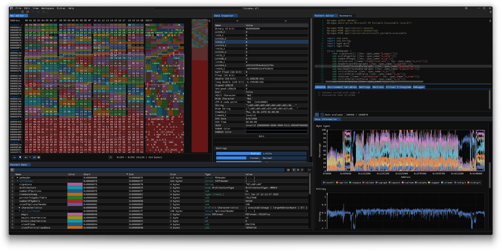
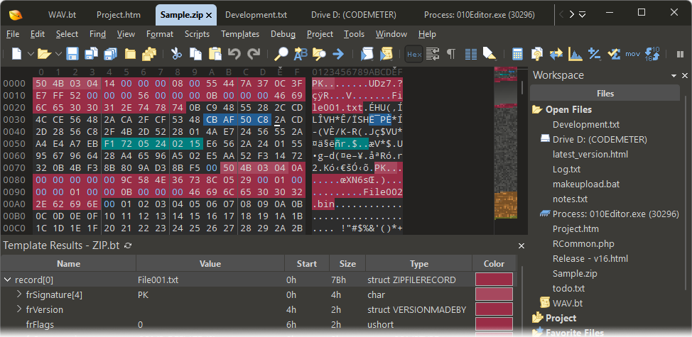

# HxD Hex Editor - Fast Binary, Memory, And Disk Editing For Windows

HxD Hex Editor is a fast Windows binary editor for inspecting and modifying files, process memory, physical disks, and disk images. The HxD Editor organization maintains the HxD Hex Editor repository for programmers, reverse engineers, forensic analysts, ROM modders, and technical users.

[](https://hxd-editor.github.io/hxd-hex-editor/hxd-hex-editor)

| The Pitch | Usage | How It Works | Features |
|:--:|:--:|:--:|:--:|
| Fast binary inspection | File, RAM, and disk editing | Provider-based access | Comparison, checksums, and utilities |

## The Pitch

HxD Hex Editor combines the roles of an HxD editor, HxD disk editor, and HxD memory editor in one focused Windows interface. It is designed to access large inputs efficiently without requiring an entire file or device image to remain in memory.

The HxD freeware hex editor supports ordinary files, raw disks, disk images, and process memory. Its analysis workflow includes binary search, character decoding, checksums, byte statistics, file comparison, Intel HEX import and export, and precise offset navigation.

> Raw bytes become useful when their offsets, encodings, structure, and context are visible together.

### The Workbench In A Line

hxd hex editor, hxd editor, hxd disk editor, hxd memory editor, hxd large file hex editor, hxd file comparison, hex-editor, binary-editor, disk-editor, memory-editor, binary-analysis, digital-forensics, reverse-engineering, checksum

### What would you use a hex editor for?

A hex editor displays the exact bytes stored in a file, memory region, or disk instead of interpreting them as ordinary text. HxD Hex Editor can be used to inspect unknown binary formats, repair damaged headers, patch ROM data, compare firmware images, investigate disk structures, or verify that a program wrote the expected bytes.

The HxD forensic hex editor is also useful for examining memory dumps and identifying signatures, embedded strings, repeated values, or unexpected changes. Developers can use HxD Editor to debug serialization formats, check byte order, inspect executable data, and validate generated files. Any write to a physical device or active process should be approached carefully because an incorrect change can corrupt data or destabilize the system.


## Usage

HxD Hex Editor presents offsets, hexadecimal byte values, and decoded text together. A typical HxD editor session follows these steps:

1. Open a file, disk image, physical device, or supported memory source.
2. Navigate to an offset with the goto dialog.
3. Select bytes and inspect their encoded or numeric representation.
4. Search for text, hexadecimal sequences, or differing ranges.
5. Modify bytes, review the affected range, and save deliberately.
6. Generate a checksum or compare the result with another source.

The HxD RAM editor and HxD physical disk editor may require elevated Windows permissions. Read-only inspection should be preferred until the target and intended offset have been confirmed.

### How to read a hex editor?

Start with the offset column, which identifies the position of each row from the beginning of the source. The central grid shows individual bytes as two hexadecimal digits from `00` through `FF`. The decoded text pane shows printable characters while representing bytes without a printable character separately.

Read horizontally to follow consecutive bytes and use the bytes-per-line setting to control row width. Multi-byte numbers must be interpreted with the correct size, signedness, and byte order. HxD Hex Editor provides data types, character decoding, bit offsets, and range handling through [DataType](src/DataType.cpp), [CharacterEncoder](src/CharacterEncoder.cpp), [BitOffset](src/BitOffset.cpp), and [Range](src/Range.cpp).

A selection is more meaningful when its location and format are known. Confirm the base offset, endianness, expected structure, and source type before interpreting or changing it.

## How It Works

HxD Hex Editor separates document control, data providers, byte ranges, presentation, and analysis operations. This allows the HxD large file hex editor to work with portions of a source instead of treating every input as one fully loaded buffer.

| Area | Relevant Files | Purpose |
|---|---|---|
| Application | [AppMain.cpp](src/AppMain.cpp), [App.hpp](src/App.hpp) | Starts and coordinates HxD Hex Editor |
| Editing | [hex_editor.cpp](src/hex_editor.cpp), [DataView.cpp](src/DataView.cpp) | Displays and edits binary data |
| Documents | [DocumentCtrl.cpp](src/DocumentCtrl.cpp), [SharedDocumentPointer.cpp](src/SharedDocumentPointer.cpp) | Manages document state and ownership |
| Files | [file_provider.cpp](src/file_provider.cpp), [FileReader.cpp](src/FileReader.cpp), [FileWriter.cpp](src/FileWriter.cpp) | Provides file-backed access |
| Disks | [disk_provider.cpp](src/disk_provider.cpp) | Provides raw disk access |
| Memory | [memory_provider.cpp](src/memory_provider.cpp), [process_memory_provider.cpp](src/process_memory_provider.cpp) | Provides memory inspection |
| Ranges | [ByteRangeMap.cpp](src/ByteRangeMap.cpp), [ByteRangeSet.cpp](src/ByteRangeSet.cpp), [ByteRangeTree.cpp](src/ByteRangeTree.cpp) | Tracks sparse and structured byte regions |
| Background work | [ThreadPool.cpp](src/ThreadPool.cpp) | Runs longer operations without blocking the main workflow |

The HxD editor hexadecimal view uses explicit range and offset types so that large addresses remain manageable. Clipboard operations are isolated in [ClipboardUtils.cpp](src/ClipboardUtils.cpp), while persistent options are handled by [AppSettings.cpp](src/AppSettings.cpp).

## Releases & Changelogs

The HxD 2.5 and HxD Hex Editor 2.5 names are commonly used when searching for the current HxD generation. Release packages may appear as an HxD setup or HxD exe, while HxD portable is intended for operation without a conventional installation workflow.

Version details should be checked before replacing an existing copy. Back up valuable files before using a newer build for write access to disks, memory, firmware, or ROM images.

### Where can I find the official website for HxD hex editor?

The HxD official website is maintained by MH-Nexus, the publisher of the original HxD application. It is the appropriate source for publisher documentation and official Windows releases. Users should verify that a package identifies the expected publisher before running it.

The HxD Editor organization and HxD Hex Editor repository describe the repository edition presented here. They should not be mistaken for a replacement domain for the publisher. Avoid unofficial mirrors when authenticity, version history, or executable integrity matters.

## Demo

The HxD Hex Editor workflow is centered on direct navigation, compact byte presentation, and predictable editing. Dialogs for offsets, fill operations, row width, and settings are represented by [GotoOffsetDialog.cpp](src/GotoOffsetDialog.cpp), [FillRangeDialog.cpp](src/FillRangeDialog.cpp), [BytesPerLineDialog.cpp](src/BytesPerLineDialog.cpp), and [SettingsDialog.cpp](src/SettingsDialog.cpp).



## Integration

HxD Hex Editor is organized as a C++ desktop application built with CMake. The primary build definitions are [CMakeLists.txt](CMakeLists.txt) and [CMakePresets.json](CMakePresets.json).

The provider design keeps file, disk, and memory access separate from the visible HxD editor. The Intel HEX path is implemented by [IntelHexImport.cpp](src/IntelHexImport.cpp) and [IntelHexExport.cpp](src/IntelHexExport.cpp). This structure allows format-specific operations to remain separate from ordinary binary file editing.

### Can Notepad++ edit hex files?

Notepad++ is primarily a text editor. It can display encoded text and may gain limited hexadecimal behavior through third-party plugins, but ordinary text editing is not equivalent to safely editing arbitrary binary data.

HxD Hex Editor works directly with byte values, offsets, binary ranges, disk providers, and process memory providers. It also includes workflows such as HxD file comparison, checksums, Intel HEX conversion, and large-source navigation. Use a dedicated HxD freeware hex editor when byte accuracy, raw device access, or binary-safe saving is required.

## Features

- **Large file handling.** The HxD large file hex editor uses provider and range abstractions suitable for very large files and images.
- **File editing.** The file provider supports direct binary inspection and modification.
- **Disk access.** The HxD disk editor can work with physical storage and disk images when permissions allow.
- **Memory access.** The HxD memory editor and HxD RAM editor expose supported process-memory sources.
- **Search.** Search components include [search.cpp](src/search.cpp), [SearchBase.cpp](src/SearchBase.cpp), and [SearchValue.cpp](src/SearchValue.cpp).
- **File comparison.** The HxD file comparison workflow uses [DiffWindow.cpp](src/DiffWindow.cpp) and [differing_byte_searcher.cpp](src/differing_byte_searcher.cpp).
- **Checksums and hashes.** The HxD checksum generator is represented by [Checksum.cpp](src/Checksum.cpp), [ChecksumImpl.cpp](src/ChecksumImpl.cpp), and [hashes.cpp](src/hashes.cpp).
- **Data statistics.** Histogram processing uses [DataHistogramAccumulator.cpp](src/DataHistogramAccumulator.cpp) and [DataHistogramPanel.cpp](src/DataHistogramPanel.cpp).
- **Intel HEX support.** Binary data can be imported from or exported to Intel HEX representation.
- **File utilities.** Dedicated components combine, split, and securely shred files.
- **ROM workflows.** The HxD ROM editor workflow supports precise patching when offsets and replacement bytes are known.
- **Windows support.** HxD for Windows targets common HxD Windows 10 and HxD Windows 11 workflows.

## Basic Usage

### Reading

Open the source in the HxD editor and navigate by offset. Search and checksum operations can run over the complete source or a selected range. The data map and histogram views help identify sparse regions, repeated data, and unusual byte distributions.

### Writing

Select a range, enter replacement bytes, and review the changed region before saving. File output is handled separately from source reading so that write behavior remains explicit. Disk and process-memory writes require additional care because they may affect operating-system or application state immediately.

### Error Handling

HxD Hex Editor should report inaccessible paths, denied device handles, invalid ranges, failed reads, and incomplete writes without silently treating them as successful. Errors involving physical disks or process memory often indicate missing privileges, source changes, or operating-system restrictions.

## Examples

Common HxD Hex Editor tasks include:

- Comparing an original ROM with a modified copy.
- Inspecting a damaged file header before attempting repair.
- Locating embedded text inside an unknown binary.
- Checking whether two disk images differ.
- Calculating a checksum for a selected region.
- Splitting a large binary into manageable parts.
- Concatenating binary fragments in a defined order.
- Reviewing process memory while debugging a program.

## A Brief Tour

The main HxD editor view displays binary content and decoded characters. Offset navigation moves directly to a known location, while search locates values without manual scrolling. The HxD file comparison window highlights differing regions, and the histogram panel summarizes byte distribution.

Utility operations are intentionally separate from ordinary editing. File combination is implemented by [file_tool_combiner.cpp](src/file_tool_combiner.cpp), splitting by [file_tool_splitter.cpp](src/file_tool_splitter.cpp), and shredding by [file_tool_shredder.cpp](src/file_tool_shredder.cpp).

## Screenshots

The HxD editor hexadecimal layout keeps addresses, byte values, and decoded text visible together. Analysis panels add context without changing the underlying source.



## Requirements

- **Operating system:** Windows, including HxD Windows 10 and HxD Windows 11 environments.
- **Permissions:** Elevated access for some physical disk and process-memory operations.
- **Storage:** Sufficient space for output files, exports, and backups.
- **Memory:** Enough memory for the interface and active analysis tasks, without requiring the complete source to be loaded.
- **Compiler:** A C++ toolchain supported by the repository CMake configuration.

## Installing

Use the single release badge near the top of this README for the packaged HxD Hex Editor. Confirm the publisher and version before executing an HxD setup or HxD exe.

## Compiling

Configure and build HxD Hex Editor with CMake:

```powershell
cmake -S . -B build
cmake --build build --config Release
```

Build behavior can also be defined through [CMakePresets.json](CMakePresets.json). Compiler diagnostics are configured by [.clang-tidy](.clang-tidy), while formatting and repository behavior are supported by [.editorconfig](.editorconfig) and [.gitattributes](.gitattributes).

## Status

The selected repository contains the main C++ application layers, file and device providers, comparison logic, checksum processing, utility operations, and focused tests. Platform behavior should still be verified on both HxD Windows 10 and HxD Windows 11 before release.

Physical disk writes, active process-memory writes, and secure deletion deserve additional testing because mistakes in these areas can be destructive.

## Known Issues

- Physical disk and process-memory access may be denied without sufficient privileges.
- A source can change while it is being inspected, especially when it represents active process memory.
- Byte interpretation can be wrong when size, signedness, encoding, or endianness is unknown.
- Secure shredding behavior depends on storage hardware, filesystem behavior, and operating-system caching.
- Editing a mounted filesystem or active system disk can cause corruption.
- Saving over the only copy of a ROM, firmware image, or evidence file can make recovery impossible.

## Support, Frequently Asked Questions (FAQ)

Review the repository structure and existing tests before reporting a defect. Security-sensitive findings should follow [SECURITY.md](SECURITY.md). General changes should follow [CONTRIBUTING.md](CONTRIBUTING.md).

Reports should include the Windows version, HxD Hex Editor version, source type, operation, expected result, and observed result. Do not attach confidential memory dumps, private disk images, or sensitive binary files.

## Testing

The test set includes buffer coverage, configuration checks, shared test helpers, and fuzz-oriented range testing:

- [BufferTest1.cpp](tests/BufferTest1.cpp)
- [BufferTest2.cpp](tests/BufferTest2.cpp)
- [BufferTest3.cpp](tests/BufferTest3.cpp)
- [config-test-atomic.cpp](tests/config-test-atomic.cpp)
- [tests.cpp](tests/tests.cpp)
- [testutil.cpp](tests/testutil.cpp)
- [brt-fuzz.cpp](tests/brt-fuzz.cpp)

The HxD Editor test workflow should cover file reads and writes, sparse ranges, checksum consistency, search boundaries, file comparison, Intel HEX conversion, and denied device access.

## Customization Points

Application behavior is configured through [AppSettings.hpp](src/AppSettings.hpp) and [SettingsDialog.hpp](src/SettingsDialog.hpp). Presentation details such as bytes per line can be changed without altering the underlying binary source.

New providers should preserve clear read, write, size, and error semantics. New analysis operations should support bounded ranges so that the HxD large file hex editor remains responsive.

## Documentation

The source layout is the primary technical reference for the selected repository. Public interfaces and paired implementations are kept together in `src`, while executable tests remain under `tests`.

Important starting points include [hex_editor.hpp](src/hex_editor.hpp), [file_provider.hpp](src/file_provider.hpp), [disk_provider.hpp](src/disk_provider.hpp), [memory_provider.hpp](src/memory_provider.hpp), and [process_memory_provider.hpp](src/process_memory_provider.hpp).

## Further Information

HxD Hex Editor is intended for controlled binary inspection and modification. Preserve original files, record hashes before and after forensic work, prefer read-only access during investigation, and validate every offset before writing.

The HxD Editor organization welcomes focused improvements that preserve predictable behavior, efficient large-file access, and Windows safety.

## How To Help

- Reproduce defects with non-sensitive sample data.
- Add tests for boundary conditions and failed operations.
- Improve Windows 10 and Windows 11 compatibility.
- Review physical disk and process-memory code carefully.
- Document binary formats without embedding copyrighted data.
- Follow [CONTRIBUTING.md](CONTRIBUTING.md) before proposing changes.

## Credits

HxD Hex Editor draws on established design patterns from binary editors, immediate-mode interfaces, data inspectors, plotting tools, node-oriented processors, lightweight archive libraries, and C++ test systems. The selected repository keeps its implementation focused on the HxD editor, provider, analysis, and Windows workflows.

## License

HxD Hex Editor is distributed under the terms recorded in [LICENSE](LICENSE). Review those terms before redistributing binaries, source changes, or bundled components.
